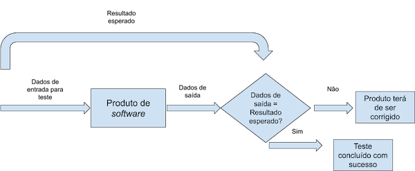

# Guia para testes de software

Eu criei este repositório não com a intenção de ser a resposta todos os assuntos relacionados com testes de software ou de ser "o" guia ideal para elaboração de testes e para escrita de relatórios de bugs e defeitos. Mas sim uma introdução bem superficial a testes de software, às informações relevantes para a sua execução assim como a criação de plano de teste, a criação de test cases e relatórios de teste, relatórios de bug entre outros aspectos.

Conteúdos
---
+ [Testes](#testes)
+ [Criar test cases](#criar-test-cases)
+ [Manual e automático](#manual-e-automatico)
+ [Bug ou defeito](#bug-ou-defeito)
+ [Material de leitura](#material-de-leitura)

## Testes
---
Podemos resumir o processo de desenvolvimento clássico de um produto da seguinte forma: **idea -> feature -> development -> testing -> release**.
Os testes agem como forma de garantir que o produto, neste caso o software, comporta ou funcione conforme as especificações definidas durante a fase de análise e desenho.

O ambiente em que os teste são realizados condiciona os resultados obtidos. A execução dos testes faz-se habitualmente num **ambiente de operação hipotético que difere do ambiente de produção real**.
Sucede que nem estes dois ambientes são exatamente iguais, nem o resultado obtido num deles é exatamente igual.

Antes da execução de qualquer teste, o tester deve criar um plano de teste juntamente com o gestor do projeto ou com a equipa de desenvolvimento. Mas antes isso é preciso saber o critério de aceitação ou *acceptance criteria*.
Critério de aceitação trata-se de um conjunto de regras formais de como uma funcionalidade deve comportar e normalmente são definidas pelo dono de projeto.
O plano de teste podem ser criados da seguinte forma:
* Escopo do teste (objetivos);
* Tempo de execução (tempo estimado para execução do teste);
* Entregas (relatórios e datas geradas pelo teste);
* Critérios para passagem de produção (condição para passagem de produção);
* Riscos e contigência (medição de incertezas de teste);
* Test cases;

## Criar test cases
---
Os test cases podem ser criados da seguinte forma:
* Nome do teste - ex. Cliente - Criar/Registar;
* Pré-requisitos - ex. O utilizador deve estar com a sessão iniciada e estar na página de registo de cliente;
* Passos - ex. Click na caixa de texto “Título”. Escolher a opção  “Sra.”. Resultado Esperado ex. “Sra.” encontra-se escrito na caixa de texto.
* Desmantelar - ex. Eliminar o cliente com o nome “Isabela Souza Costa”.

Test cases por ser visto de duas formas:
*Happy paths* -> o tester testa com o fim de atingir o resultado desejado/esperado;
*Edgy cases* -> o tester testa com o fim de explorar a aplicação encontrando ou não falhas.

## Manual e automático
---
Um **teste manual** é quando o teste de um software ou aplicação web é feito manualmente pelo tester com objetivo de encontrar bugs no software ou aplicação web a ser desenvolvido. O tester verifica todas as funcionalidades essenciais do sujeito software ou aplicação web executando todos os *test cases* e gerando relatórios sem ajuda de ferramentos de automatização.
Um **teste automático ou automatizado** é quando os testers escrevem código/scripts para automatizar a execução de um teste. O objectivo e completar a execução do teste em menor tempo possível.

## Bug ou defeito
---
Bug de software é tudo que se trata de um erro, falha num programa de computador ou sistema que o faz comportar de forma incorrecta ou inesperada.
Para fazer um relatório de bugs podemos considerar o seguinte formato:
* Título.
* Descrição.
* Localização (url).
* Screenshots/videos.
* Passos para reproduzir.
* Resultado esperado.
* Resultado atual.
* Dados.
* Utilizador (o tester ou a pessoa que encontrou o bug).
* Alternativa (forma alternativa de superar o bug).
* Data.
* Estado (aberto ou fechado).
* Severidade.
* Prioridade.

A atenção a um bug ou defeito pode ser consideravelmente diferenciada pela:
* Severidade -> conjunto de critérios rigorosamente definidos de como severo é o bug para o sistema.
* Prioridade -> corresponde aos bug que requer maior/menor atenção. É normalmente definido pelo dono do projecto ou a equipa de desenvolvimento.
A severidade pode ser baixa (defeitos visuais que são facilmente superarados pelo utilizador e não afeta os seus dados), média (defeitos que podem afetar os dados mas como forma de superar), alta (defeitos que podem ter um impacto considerável nos dados) e crítica.

## Material de leitura
---
+ [Usability Testing Tutorial: Need, Process, Best Practice](https://www.guru99.com/usability-testing-tutorial.html)
+ [Automation Testing Vs. Manual Testing: What’s the Difference?](https://www.guru99.com/difference-automated-vs-manual-testing.html)
+ [Automation Testing Tutorial: Process, Planning & Tools](https://www.guru99.com/automation-testing.html)
+ [What is Regression Testing? Test Cases, Tools & Examples](https://www.guru99.com/regression-testing.html)
+ [Integration Testing Tutorial: Big Bang, Top Down & Bottom Up](https://www.guru99.com/integration-testing.html)
+ [GUI Testing: Complete Guide](https://www.guru99.com/gui-testing.html)
+ [Functional Testing](https://test.io/functional-testing/)
